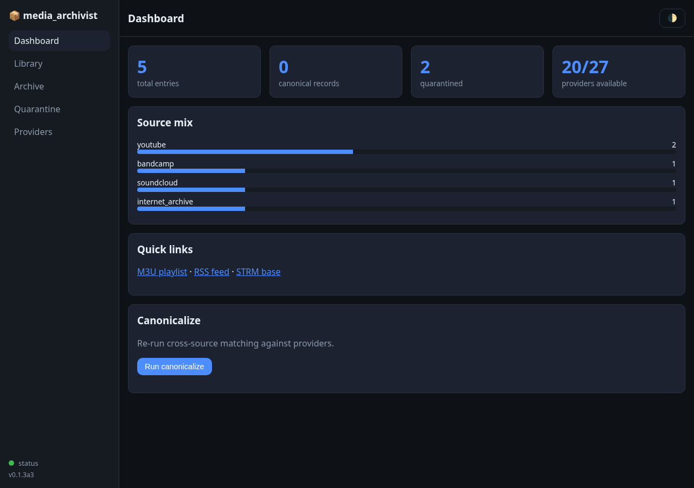
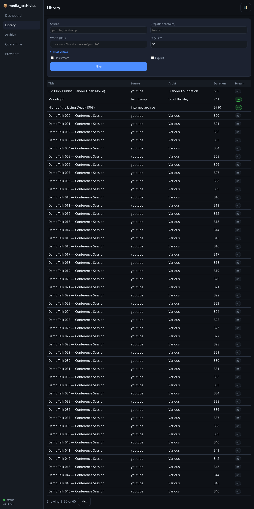
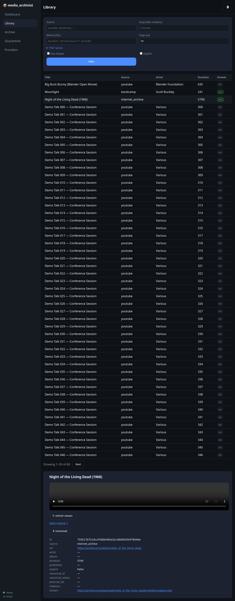
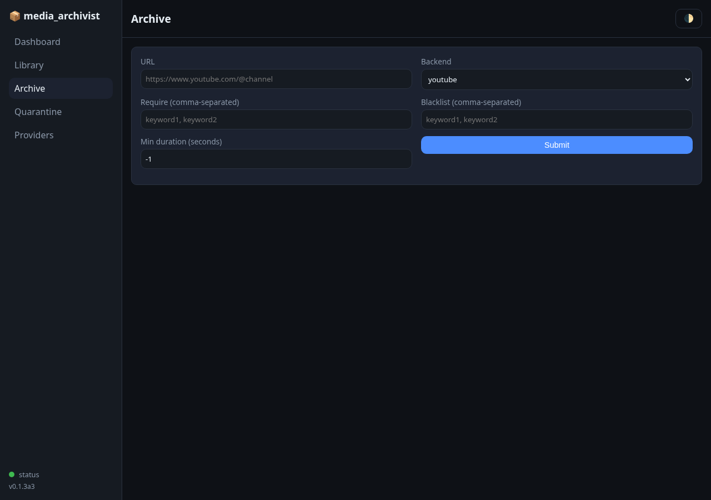
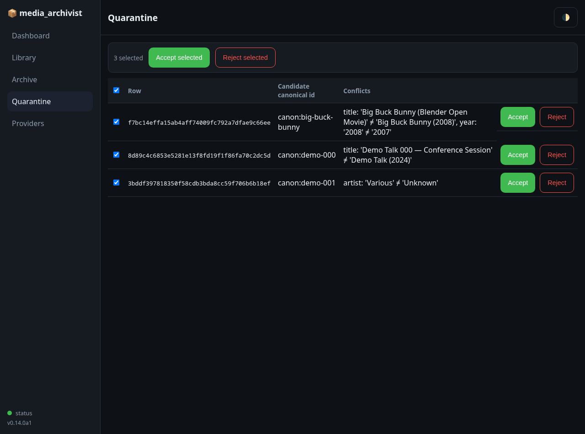
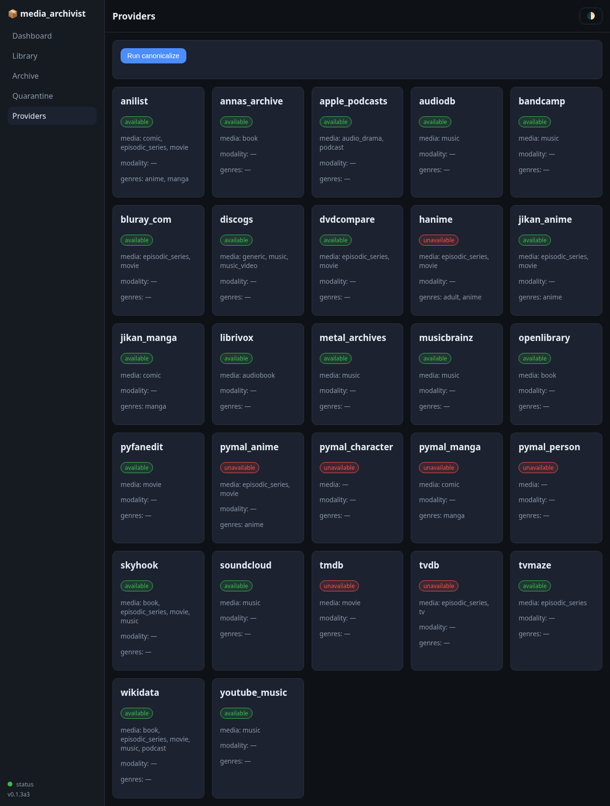
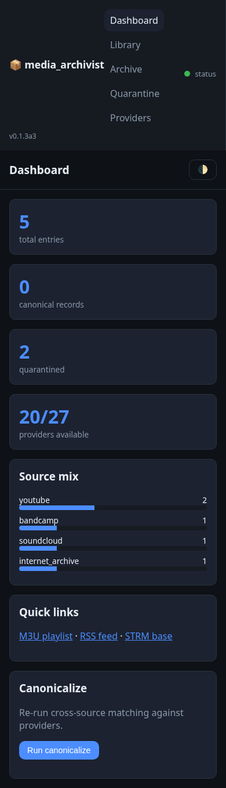

# Web UI

`media-archivist serve` ships a build-free [htmx](https://htmx.org) Web UI
alongside the JSON API, no Node, no JS build step. It's meant for homelab
use: point it at a DB file, open a browser, manage your index.

## Launch it

```bash
pip install "media-archivist[server]"
media-archivist serve --db-file talks.json
# open http://localhost:8000/
```

Or with Docker (see [`deploy.md`](./deploy.md) for the full compose setup):

```bash
docker compose -f deploy/docker-compose.yml up
```

## Dashboard

Landing page: entry counts, quarantine count, provider coverage
(e.g. `20/27 providers`), a source-mix bar chart, quick links to the M3U
playlist, RSS feed and `.strm` export, and a one-click canonicalize button
to re-run the resolver against the DB.



## Library

Browse every entry in the DB. The filter form supports source, free-text
grep, and the `where` DSL (the same query language the CLI and API use),
plus a page-size limit. Each row shows a yes/no stream badge so you can spot
entries missing a resolvable stream at a glance. Results are paginated —
"Showing 1–50 of 60" with Prev/Next buttons that carry the current filter
along (`hx-include`d from the filter form), so you can page through a large
DB without re-typing the query.



Click into a row for the entry detail drawer: thumbnail and full metadata,
external IDs, and an **inline player**:

- if the entry already has a direct stream URL (Bandcamp, SoundCloud, IA),
  it plays straight in a native `<audio>` or `<video>` element;
- if it's a YouTube entry, a "▶ Play" button lazy-loads a
  `youtube-nocookie.com` iframe embed on click (no autoplay, no tracking
  before you press play);
- when `yt-dlp` is available server-side, a "▶ Play (yt-dlp)" button
  resolves and plays the direct media URL instead of embedding, and a
  "↻ refresh stream" button lets you re-resolve an entry whose stored
  `stream` URL may have gone stale;
- "Open original ↗" always links back to the source page;
- a "⬇ Download" button (shown whenever `yt-dlp` is available) kicks off a
  background download job for that entry — see
  [Optional download](#optional-download) below.



## Archive

Kick off a new archive job from the browser: paste a URL, pick a backend
(YouTube, YT Music, Bandcamp, SoundCloud, Internet Archive), and set
`--require` / `--blacklist` / `--min-duration` filters. Progress polls live,
no page refresh needed.



## Quarantine

When the resolver can't confidently match an entry against the canonical
index, it lands here instead of silently merging. Each conflict is shown
with its candidate canonical id and the fields in conflict, and per-row
Accept/Reject buttons, no need to hand-edit the quarantine JSON sidecar.

Check the box on any number of rows and a bulk action bar appears: "Accept
selected" / "Reject selected" apply the decision to every checked row in one
call, with a confirmation prompt before either. A header checkbox selects or
clears all rows at once. Useful once you've eyeballed a batch and just want
to clear the queue.



## Optional download

media-archivist's job is streaming, not downloading, but sometimes you want
a specific entry on disk. The "⬇ Download" button posts to
`/entries/{id}/download`, which is scheduler-backed exactly like an archive
job: it queues, runs, and reports progress via `GET /tasks/{task_id}`. Files
land under `MEDIA_ARCHIVIST_DOWNLOAD_DIR`. The button (and the endpoint) only
appear/work when `yt-dlp` is available on the server — a 503 otherwise.

For playback without downloading, see
[`.strm` + play-time resolution in jellyfin.md](jellyfin.md#recommended-play-time-resolution-with-resolve1),
which the "▶ Play (yt-dlp)" / "↻ refresh stream" buttons above use the same
resolver as.

## Providers

A grid of every metadatarr provider media-archivist knows about, and
whether it's currently available (installed + reachable).



## Responsive, themeable

The UI works down to phone width and follows your OS light/dark preference.
Useful for checking on an archive job from your homelab network without a
laptop.



## Security

Like the rest of the HTTP service, the Web UI has **no built-in
authentication**. It's designed for single-tenant, LAN-only use. If you need
to reach it beyond your local network, put it behind a reverse proxy
(Caddy, Traefik, nginx) — see [`deploy.md`](./deploy.md) for examples and
the full route table.

## Troubleshooting

- **Port already in use** — `media-archivist serve` binds `:8000` by
  default. Pass `--port` to pick another one, or find and stop whatever's
  already bound: `lsof -i :8000`.
- **"where: ..." error on the Library page** — the `where` DSL rejected
  your filter (unsupported syntax, unknown field, or disallowed operator).
  It's surfaced inline as an HTTP 400 on the filter fragment, not a page
  crash; fix the expression and resubmit.
- **A provider shows "unavailable" on the Providers page** — most
  metadatarr providers need an API key or local credentials file. Check the
  provider's own docs for the expected environment variable; an unavailable
  provider is skipped during canonicalization, it doesn't block indexing.
- **Running behind a reverse proxy** — the UI honours `root_path` for
  every link and htmx `hx-get`/`hx-post` target, so it works fine mounted
  under a sub-path. See [`deploy.md`](./deploy.md) for a Caddy/Traefik/nginx
  example; forward `X-Forwarded-*` headers as usual.
